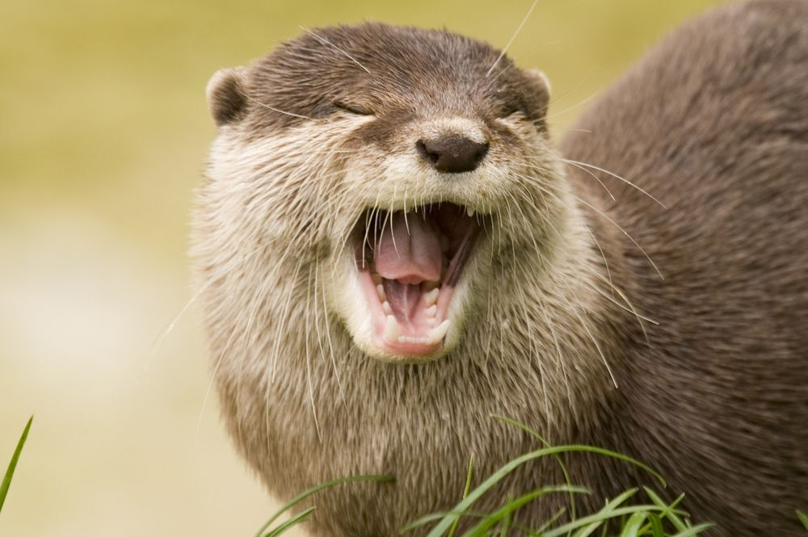

# 2024 Group 1

**Greta Berg, Kennedie Dolton, Kacie Lau, Elise Son**

species:

## Our favorite species

**Kennedie:** One of my favorite species is the regular garden snail! I have always liked them and starting from when I was a toddler, every time I saw a snail crossing a path I would move them over to the other side so they didn't get trampled. They're great!

**Greta:** My favorite species is the black bear because they can climb trees and they eat berries. You can see them camping in the woods and its alarming, but not as alarming as seeing a grizzly bear. They are so cute and I wish I could give one a hug but that would most likely go poorly.

**Kacie:** My favorite species at the moment are otters. They're intelligent, semi-tool users, adorable, have really cool sleeping behaviors, are keystone species, and have super-dense fur that make them waterproof! Also have been into red pandas lately. Both are all over my Instagram feed :)

